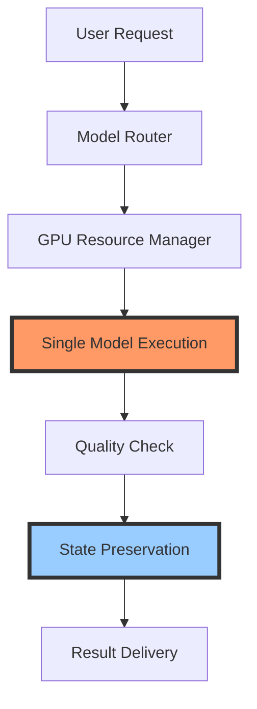

<<<<<<< HEAD
# Insane-Bolt
"📚 ECHO Learning Academy: AI-driven educational and development platform for coding excellence." "🎓 Building smarter learning systems with Bolt.new, Cascade, and Windsurf integration." "🌐 ECHO Learning Academy: Merging AI with education and development for next-gen solutions."
=======
# 🚀 Bolt.new Enhanced Documentation

> 🌟 Next-generation AI task orchestration and resource management system with a focus on GPU resource management, model orchestration, and state preservation.

[](https://travis-ci.org/bolt-new/bolt-new)
[](https://codecov.io/gh/bolt-new/bolt-new)
[](LICENSE)

## 🎯 Overview

This documentation covers the enhanced version of bolt.new, focusing on GPU resource management, model orchestration, and state preservation. The project implements a quality-first approach using single GPU (4060) optimization.



## 🚀 Quick Start

1. Clone the repository:
```bash
git clone https://github.com/your-repo/bolt.new.git
cd bolt.new
```

2. Install dependencies:
```bash
npm install
```

3. Configure GPU settings:
```bash
# Edit .env file with your GPU preferences
cp .env.example .env
```

4. Start the development server:
```bash
npm run dev
```

5. Access the application:
- Open http://localhost:3000 in your browser
- Review system status in the dashboard

## 📚 Documentation Structure

### Core Documentation
- [`/docs/architecture/`](./docs/architecture/) - 🏗️ System architecture and core components
- [`/docs/implementation/`](./docs/implementation/) - 💡 Implementation guides and standards
- [`/docs/development/`](./docs/development/) - 🔧 Development guidelines and practices
- [`/docs/operation/`](./docs/operation/) - 📈 Setup and maintenance procedures
- [`/docs/user/`](./docs/user/) - 📚 User guides and best practices
- [`/docs/project/`](./docs/project/) - 📈 Project management and version control
- [`/docs/future/`](./docs/future/) - 🔮 Roadmap and enhancement plans

## 🎯 Key Features

- 🧠 Single GPU optimization (NVIDIA 4060)
- 🔄 Quality-first approach with dedicated resource allocation
- 📊 Comprehensive state preservation system
- 🤝 Intelligent model orchestration
- 🔧 Advanced resource management

## 🚀 Codeium Windsurf Integration

### 🤖 Cascade AI Assistant
Bolt is fully integrated with Cascade, the powerful agentic AI assistant in Codeium Windsurf. Key features include:

- **AI Flow Paradigm**: Seamless collaboration between human developers and AI
- **Agentic Capabilities**: Independent problem-solving and proactive assistance
- **Context-Aware**: Maintains conversation history and project context
- **Tool Integration**: Direct access to project tools and commands
- **Code Generation**: Intelligent code creation and modification
- **Documentation**: Automated documentation updates and maintenance

### 🌊 Windsurf IDE Features
As the world's first agentic IDE, Windsurf provides:

- **Real-time Collaboration**: Seamless interaction between developer and AI
- **Context Management**: Intelligent tracking of project state and requirements
- **Resource Optimization**: Efficient handling of system resources
- **Intelligent Scheduling**: Smart prioritization of tasks and operations
- **Quality Assurance**: Automated code quality checks and suggestions

## 🚀 Contributing

1. Review our [Development Guidelines](./docs/development/GUIDELINES.md)
2. Check the [Issue Tracker](https://github.com/your-repo/bolt.new/issues)
3. Submit Pull Requests following our [PR Template](./docs/project/PR_TEMPLATE.md)

## 🔮 Roadmap Highlights

- 🎯 Enhanced GPU utilization monitoring
- 🚀 Advanced state preservation mechanisms
- 🤝 Multi-model learning system
- 🔧 Improved resource allocation
- [Full Roadmap](./docs/future/ROADMAP.md)

## 🤝 Key Terminology

- **State Preservation**: System for maintaining context and decisions across sessions
- **GPU Optimization**: Dedicated single-model execution for maximum quality
- **Model Orchestration**: Intelligent task routing and resource allocation
- **Quality-First Approach**: Prioritizing output quality over processing speed

## 📝 License

This project is licensed under the MIT License - see the [LICENSE](LICENSE) file for details.

## 🙏 Acknowledgments

- OpenAI team for GPT models
- NVIDIA for GPU optimization insights
- Our amazing community of contributors
>>>>>>> f6f35bb (Initial project setup with documentation and structure)
