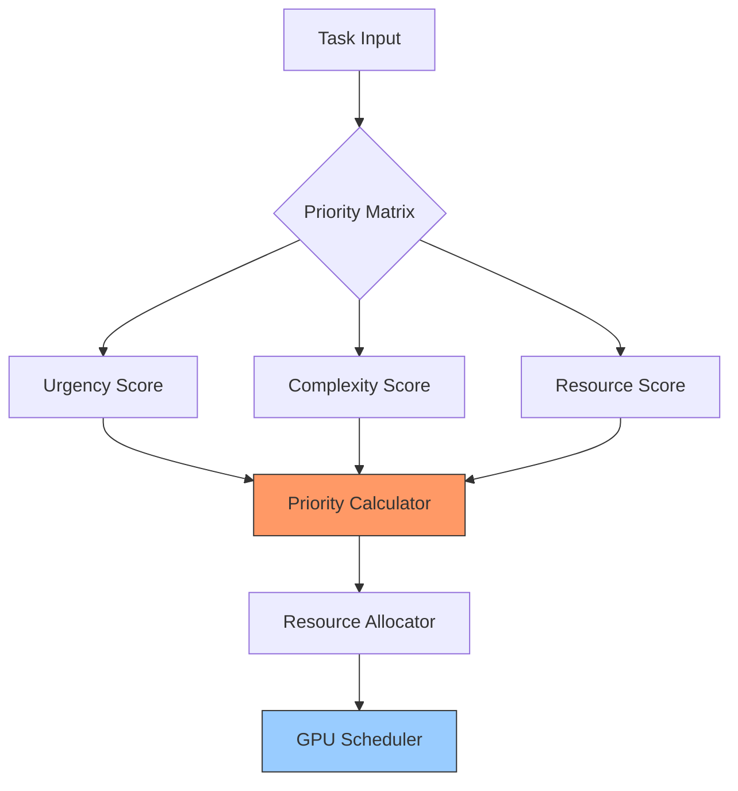
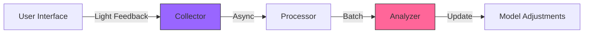
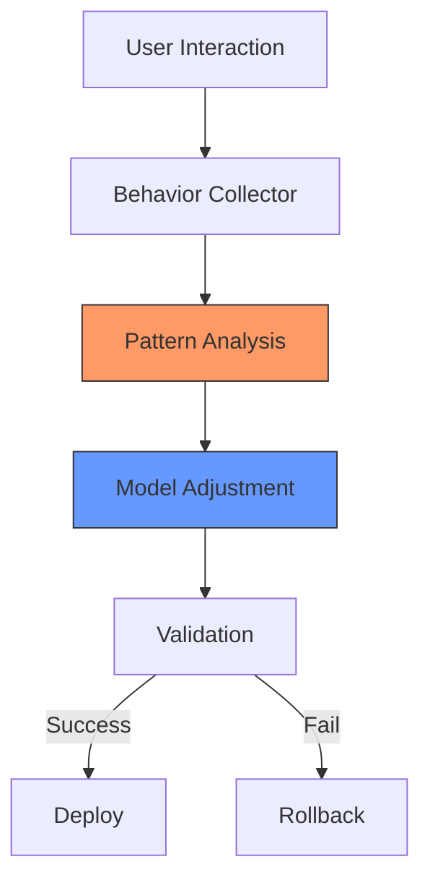
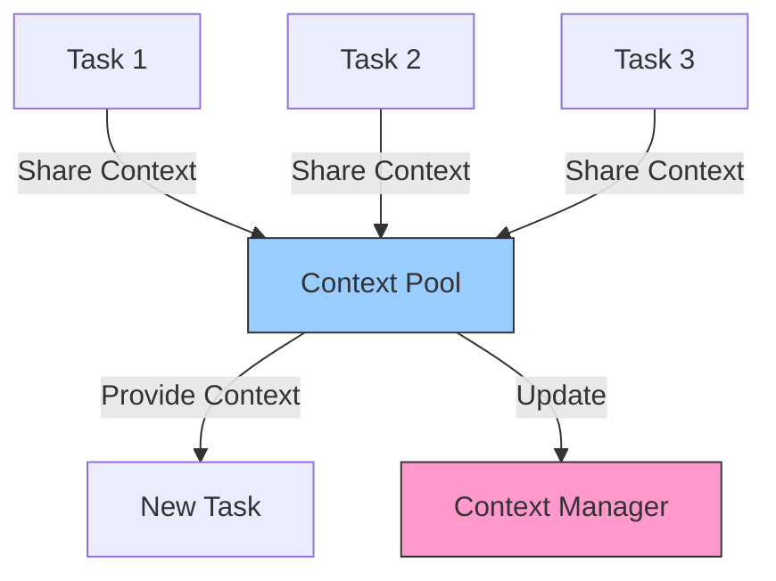
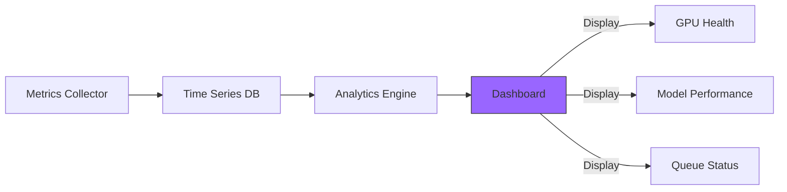
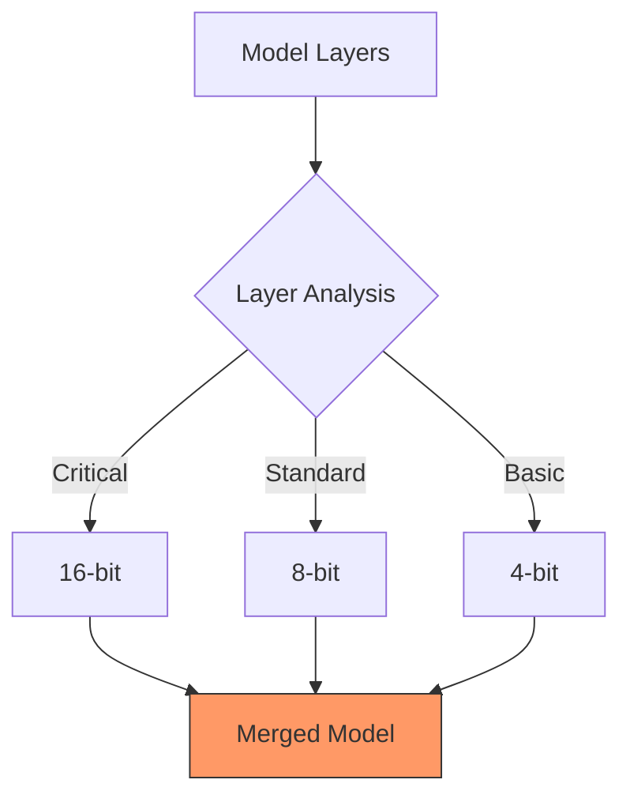
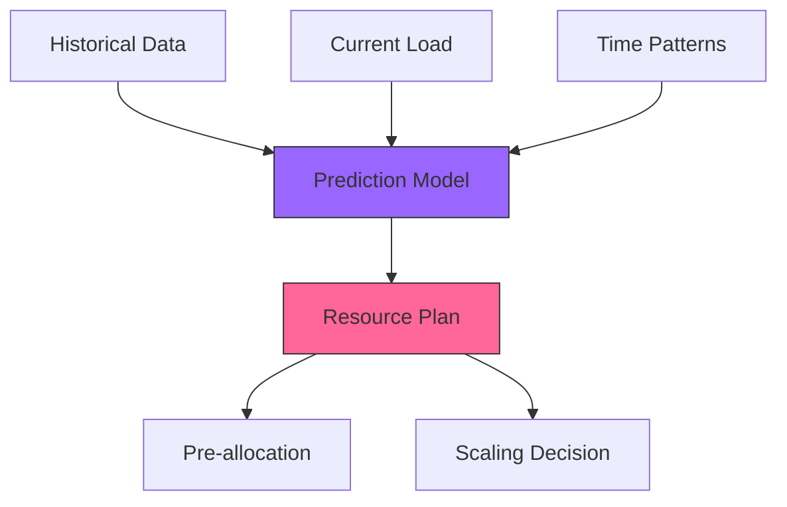

# Advanced Features and Dynamic Optimization

## Dynamic GPU Resource Management

### Priority Matrix System


### Resource Allocation Strategy
```typescript
interface TaskPriority {
    urgency: number;      // 0-1: deadline proximity
    complexity: number;   // 0-1: computational needs
    importance: number;   // 0-1: business value
    quality: number;      // 0-1: required quality
}

interface ResourceAllocation {
    gpu: {
        memory: number;   // MB allocated
        compute: number;  // % of GPU cores
        priority: number; // scheduling priority
    };
    timeSlice: number;    // ms of dedicated GPU time
    preemptible: boolean; // can be interrupted
}
```

## Real-Time Feedback System

### Feedback Collection Pipeline


### Implementation
```typescript
interface FeedbackCollector {
    // Lightweight collection
    collectFeedback(feedback: UserFeedback): Promise<void>;
    
    // Batch processing
    processFeedbackBatch(interval: number): Promise<void>;
    
    // Model updates
    updateModelBehavior(insights: FeedbackInsights): Promise<void>;
}

interface UserFeedback {
    taskId: string;
    rating: number;
    category: 'quality' | 'speed' | 'relevance';
    timestamp: number;
    context: {
        modelUsed: string;
        resourceProfile: ResourceMetrics;
        executionTime: number;
    };
}
```

## Adaptive Learning Pipeline

### Behavior Analytics System


### Analytics Implementation
```typescript
interface BehaviorAnalytics {
    patterns: {
        userPreferences: Map<string, Preference>;
        taskPatterns: TaskPattern[];
        resourceUsage: ResourcePattern[];
    };
    
    insights: {
        modelPerformance: PerformanceMetrics;
        userSatisfaction: SatisfactionMetrics;
        resourceEfficiency: EfficiencyMetrics;
    };
}

interface ModelAdjustment {
    targetModel: string;
    adjustments: {
        parameters: ParameterChanges;
        weights: WeightUpdates;
        behavior: BehaviorModification;
    };
    validation: ValidationCriteria;
}
```

## Cross-Task Context Management

### Context Sharing Architecture


### Implementation
```typescript
interface SharedContext {
    global: {
        projectState: ProjectState;
        userPreferences: UserPreferences;
        resourceState: ResourceState;
    };
    
    taskSpecific: Map<string, TaskContext>;
    
    relationships: {
        dependencies: DependencyGraph;
        influences: InfluenceMap;
    };
}

class ContextManager {
    async shareContext(source: string, target: string): Promise<void>;
    async updateGlobalContext(update: ContextUpdate): Promise<void>;
    async optimizeContextStorage(): Promise<void>;
}
```

## Advanced Monitoring System

### Unified Dashboard Architecture


### Metrics Implementation
```typescript
interface UnifiedMetrics {
    gpu: {
        health: GPUHealthMetrics;
        utilization: GPUUtilizationMetrics;
        memory: GPUMemoryMetrics;
    };
    
    models: {
        performance: ModelPerformanceMetrics;
        quality: QualityMetrics;
        efficiency: EfficiencyMetrics;
    };
    
    tasks: {
        queue: QueueMetrics;
        completion: CompletionMetrics;
        distribution: TaskDistributionMetrics;
    };
}
```

## Hybrid Quantization System

### Layer-Specific Quantization


### Implementation
```typescript
interface QuantizationStrategy {
    layerConfig: Map<string, {
        precision: 4 | 8 | 16;
        strategy: 'static' | 'dynamic';
        optimization: 'speed' | 'memory' | 'balanced';
    }>;
    
    validation: {
        accuracyThreshold: number;
        performanceTarget: number;
        memoryLimit: number;
    };
}
```

## Predictive Resource Management

### Resource Prediction System


### Implementation
```typescript
interface ResourcePredictor {
    historical: {
        patterns: UsagePattern[];
        peaks: PeakUsage[];
        efficiency: EfficiencyMetrics[];
    };
    
    prediction: {
        shortTerm: ResourcePrediction;  // next hour
        mediumTerm: ResourcePrediction; // next day
        longTerm: ResourcePrediction;   // next week
    };
    
    actions: {
        preallocation: PreallocationPlan;
        scaling: ScalingPlan;
        optimization: OptimizationPlan;
    };
}
```

## System Integration

### Feedback-Prediction Integration

```typescript
interface FeedbackMetrics {
    taskId: string;
    modelId: string;
    quality: number;
    latency: number;
    resourceUsage: ResourceMetrics;
}

class IntegratedPredictor {
    private feedbackBuffer: FeedbackMetrics[] = [];
    private readonly contextPool: ContextPool;
    private readonly scheduler: GPUScheduler;
    
    constructor(
        private readonly minFeedbackSamples: number = 100,
        private readonly predictionInterval: number = 5000
    ) {
        this.startPredictionLoop();
    }
    
    async incorporateFeedback(metrics: FeedbackMetrics): Promise<void> {
        this.feedbackBuffer.push(metrics);
        await this.updateResourceAllocation();
        await this.adjustTaskPriorities();
    }
    
    private async updateResourceAllocation(): Promise<void> {
        const predictions = await this.generatePredictions();
        await this.scheduler.adjustAllocation(predictions);
        await this.contextPool.optimizeSharing(predictions);
    }
    
    private async adjustTaskPriorities(): Promise<void> {
        const patterns = this.analyzeFeedbackPatterns();
        await this.scheduler.updatePriorities(patterns);
    }
    
    private async startPredictionLoop(): Promise<void> {
        setInterval(async () => {
            if (this.feedbackBuffer.length >= this.minFeedbackSamples) {
                const analysis = await this.analyzePerformanceTrends();
                await this.updateModels(analysis);
                this.feedbackBuffer = [];
            }
        }, this.predictionInterval);
    }
}
```

### Context Pool Management

```typescript
interface ContextMetadata {
    taskId: string;
    modelId: string;
    size: number;
    lastAccessed: Date;
    accessCount: number;
    sharedWith: string[];
}

class ContextPool {
    private contexts: Map<string, ContextData> = new Map();
    private readonly maxPoolSize: number;
    private readonly sharingThreshold: number;
    
    async optimizeSharing(predictions: ResourcePrediction[]): Promise<void> {
        const sharingPlan = this.generateSharingPlan(predictions);
        await this.implementSharing(sharingPlan);
        await this.pruneUnusedContexts();
    }
    
    private generateSharingPlan(predictions: ResourcePrediction[]): SharingPlan {
        return predictions
            .filter(p => p.contextReuse > this.sharingThreshold)
            .map(p => ({
                sourceTask: p.taskId,
                targetTasks: this.findCompatibleTasks(p),
                expectedBenefit: this.calculateBenefit(p)
            }));
    }
    
    private async implementSharing(plan: SharingPlan): Promise<void> {
        for (const share of plan) {
            const context = this.contexts.get(share.sourceTask);
            if (context && this.canShare(context, share.targetTasks)) {
                await this.shareContext(context, share.targetTasks);
            }
        }
    }
    
    private async pruneUnusedContexts(): Promise<void> {
        const now = new Date();
        for (const [id, context] of this.contexts) {
            const age = now.getTime() - context.lastAccessed.getTime();
            if (age > this.maxAge && context.accessCount < this.minAccess) {
                await this.removeContext(id);
            }
        }
    }
}
```

## Performance Monitoring

### Real-Time Dashboard

```typescript
interface DashboardMetrics {
    gpu: GPUMetrics;
    models: ModelMetrics[];
    tasks: TaskMetrics[];
    alerts: Alert[];
}

class MonitoringDashboard {
    private readonly metrics: MetricsCollector;
    private readonly alertSystem: AlertSystem;
    
    async updateMetrics(): Promise<void> {
        const current = await this.metrics.collect();
        await this.analyzeMetrics(current);
        await this.updateVisualizations(current);
    }
    
    private async analyzeMetrics(metrics: DashboardMetrics): Promise<void> {
        // Check for critical conditions
        if (metrics.gpu.memoryUsage > 0.9) {
            await this.alertSystem.raise({
                level: 'critical',
                component: 'GPU',
                message: 'Memory usage exceeding 90%',
                metrics: metrics.gpu
            });
        }
        
        // Analyze model performance
        for (const model of metrics.models) {
            if (model.accuracy < model.baseline * 0.9) {
                await this.alertSystem.raise({
                    level: 'warning',
                    component: 'Model',
                    message: `Performance degradation detected for ${model.id}`,
                    metrics: model
                });
            }
        }
    }
}
```

### Performance Optimization

```typescript
interface LayerConfig {
    id: string;
    type: string;
    precision: number;
    performance: PerformanceMetrics;
}

class ModelOptimizer {
    private readonly quantizationProfiles: Map<string, QuantizationProfile> = new Map();
    
    async optimizeModel(modelId: string): Promise<void> {
        const profile = await this.analyzeModel(modelId);
        const layers = await this.identifyCriticalLayers(profile);
        
        for (const layer of layers) {
            const optimalPrecision = await this.findOptimalPrecision(layer);
            await this.quantizeLayer(layer, optimalPrecision);
        }
        
        await this.validateAccuracy(modelId);
    }
    
    private async findOptimalPrecision(layer: LayerConfig): Promise<number> {
        const precisions = [32, 16, 8];
        let bestConfig = {
            precision: 32,
            score: 0
        };
        
        for (const precision of precisions) {
            const score = await this.evaluateConfiguration({
                ...layer,
                precision
            });
            
            if (score > bestConfig.score) {
                bestConfig = { precision, score };
            }
        }
        
        return bestConfig.precision;
    }
}
```

## Task Management

### Dynamic Task Chunking

```typescript
interface ChunkingStrategy {
    maxChunkSize: number;
    priorityThreshold: number;
    resourceLimit: ResourceMetrics;
}

class TaskChunker {
    private readonly strategies: Map<string, ChunkingStrategy> = new Map();
    
    async optimizeChunking(task: Task): Promise<Task[]> {
        const strategy = await this.selectStrategy(task);
        const chunks = await this.splitTask(task, strategy);
        return this.validateChunks(chunks);
    }
    
    private async selectStrategy(task: Task): Promise<ChunkingStrategy> {
        const metrics = await this.analyzeTaskRequirements(task);
        const availableResources = await this.getCurrentResources();
        
        return {
            maxChunkSize: this.calculateOptimalChunkSize(metrics, availableResources),
            priorityThreshold: this.calculatePriorityThreshold(task),
            resourceLimit: this.calculateResourceLimits(availableResources)
        };
    }
    
    private async splitTask(task: Task, strategy: ChunkingStrategy): Promise<Task[]> {
        const chunks = [];
        let remaining = task;
        
        while (remaining) {
            const chunk = await this.createChunk(remaining, strategy);
            chunks.push(chunk);
            remaining = await this.updateRemaining(remaining, chunk);
        }
        
        return chunks;
    }
}
```

## Risk Mitigation

### Fallback System

```typescript
interface FallbackConfig {
    maxRetries: number;
    backoffMs: number;
    alternatives: string[];
}

class FallbackManager {
    private readonly strategies: Map<string, FallbackStrategy> = new Map();
    
    async handleFailure(error: Error, task: Task): Promise<Result> {
        const strategy = await this.selectFallbackStrategy(error, task);
        return await this.executeFallback(strategy, task);
    }
    
    private async selectFallbackStrategy(error: Error, task: Task): Promise<FallbackStrategy> {
        if (error instanceof GPUMemoryError) {
            return {
                type: 'split',
                config: await this.getOptimalSplitConfig(task)
            };
        }
        
        if (error instanceof ModelError) {
            return {
                type: 'alternate_model',
                config: await this.findAlternativeModel(task)
            };
        }
        
        return {
            type: 'cpu_fallback',
            config: await this.prepareCPUFallback(task)
        };
    }
    
    private async executeFallback(strategy: FallbackStrategy, task: Task): Promise<Result> {
        const execution = new FallbackExecution(strategy, task);
        await execution.prepare();
        return await execution.run();
    }
}
```

## Implementation Timeline

### Phase 1: Core Infrastructure (Weeks 1-4)
- GPU Scheduler implementation
- Basic feedback collection
- Initial monitoring setup

### Phase 2: Advanced Features (Weeks 5-8)
- Context pool management
- Predictive resource allocation
- Enhanced monitoring dashboard

### Phase 3: Optimization (Weeks 9-12)
- Model quantization
- Task chunking
- Fallback mechanisms

### Phase 4: Integration and Testing (Weeks 13-16)
- System integration
- Performance testing
- Documentation and deployment

## Success Metrics

### Performance Indicators
- GPU utilization > 80%
- Task latency reduction > 30%
- Context reuse rate > 50%
- Prediction accuracy > 85%

### Quality Metrics
- Model accuracy deviation < 5%
- User feedback satisfaction > 90%
- System uptime > 99.9%
- Alert response time < 5 minutes

## Future Enhancements

### Planned Features
1. Multi-GPU orchestration
2. Automated model architecture optimization
3. Advanced caching strategies
4. Distributed context sharing

### Research Areas
1. Dynamic architecture adaptation
2. Zero-shot task optimization
3. Predictive resource scaling
4. Cross-model knowledge transfer

## Best Practices

### Implementation Strategy
1. Start with core GPU scheduling
2. Add basic feedback collection
3. Implement context sharing
4. Enable predictive features
5. Optimize based on metrics

### Quality Assurance
1. Continuous monitoring
2. Regular benchmarking
3. User feedback analysis
4. Performance optimization

### Resource Management
1. Dynamic allocation
2. Predictive scaling
3. Efficient sharing
4. Optimal utilization

### Development Workflow
1. Modular implementation
2. Continuous testing
3. Iterative improvement
4. Performance tracking
