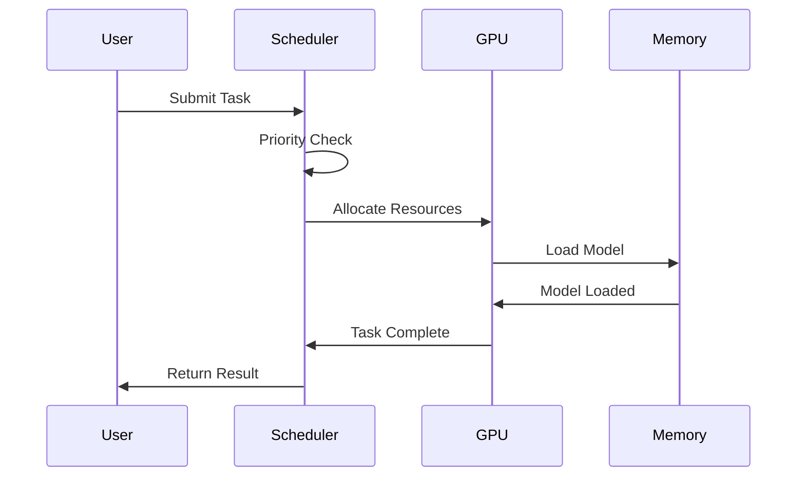
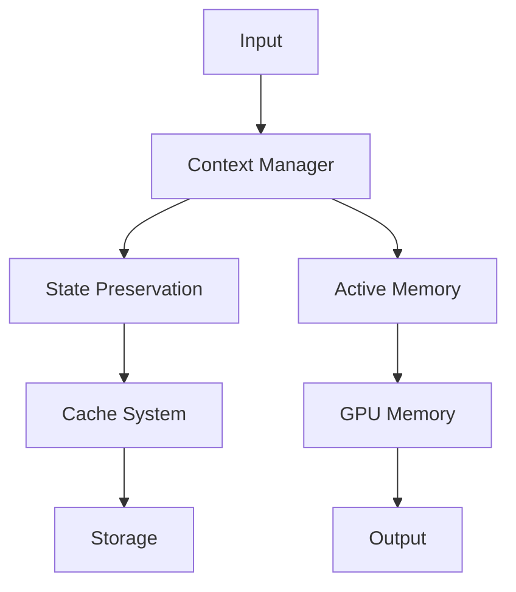

# Implementation Guide

## Project Structure

### Core Components
```
/bolt.new/
├─ /app
│  ├─ /components
│  │  ├─ /workbench    # IDE and preview
│  │  ├─ /chat         # Communication interface
│  │  └─ /memory       # State management
│  ├─ /lib
│  │  ├─ /.server      # Server-side logic
│  │  └─ /stores       # State management
│  └─ /routes          # API endpoints
├─ /project-memory     # Project state preservation
└─ /docs              # Documentation
```

## Command Line Operations

### GPU Management
```bash
# Start GPU scheduler
npm run start-gpu-scheduler

# Monitor GPU performance
nvidia-smi --query-gpu=utilization.gpu,memory.total,memory.used --format=csv

# Clear GPU cache
npm run clear-gpu-cache

# Run performance diagnostics
npm run diagnose-gpu
```

### Testing Commands
```bash
# Run all tests
npm run test

# Run unit tests
npm run test:unit

# Run integration tests
npm run test:integration

# Run GPU-specific tests
npm run test:gpu
```

## System Components

### GPU Scheduler


### Memory System


## Performance Metrics

### Key Indicators
| Metric | Target | Description |
|--------|---------|------------|
| Latency | <100ms | Task processing time |
| GPU Utilization | >90% | Resource efficiency |
| Cache Hit Rate | >80% | Memory efficiency |
| Quality Score | >95% | Output accuracy |

### Monitoring
```bash
# Real-time metrics
npm run metrics:watch

# Generate performance report
npm run metrics:report

# Export metrics dashboard
npm run metrics:export
```

## Security Implementation

### API Security
```typescript
interface SecurityConfig {
    apiKeys: {
        encryption: 'AES-256',
        storage: 'SecureVault',
        rotation: '30days'
    },
    access: {
        roles: ['admin', 'user', 'viewer'],
        permissions: ['read', 'write', 'execute']
    }
}
```

### Data Protection
- Encryption at rest using AES-256
- Secure state preservation
- Access control implementation
- Audit logging

## CI/CD Pipeline

```yaml
name: Bolt.new CI/CD

on:
  push:
    branches: [ main ]
  pull_request:
    branches: [ main ]

jobs:
  test:
    runs-on: ubuntu-latest
    steps:
      - uses: actions/checkout@v2
      - name: Setup Node.js
        uses: actions/setup-node@v2
      - name: Install Dependencies
        run: npm install
      - name: Run Tests
        run: npm test

  deploy:
    needs: test
    runs-on: ubuntu-latest
    steps:
      - name: Deploy to Production
        run: npm run deploy
```

## Quality Assurance

### Validation Process
1. Automated Testing
   ```bash
   # Run validation suite
   npm run validate
   
   # Check output quality
   npm run quality-check
   ```

2. Performance Validation
   ```bash
   # GPU performance test
   npm run test:gpu-performance
   
   # Memory usage test
   npm run test:memory-profile
   ```

3. User Feedback Collection
   ```typescript
   interface FeedbackMetrics {
       taskSuccess: boolean;
       outputQuality: number;
       processingTime: number;
       resourceEfficiency: number;
   }
   ```

## Troubleshooting

### Common Issues
1. GPU Memory Issues
   ```bash
   # Clear GPU memory
   npm run clear-gpu
   
   # Check memory status
   npm run check-memory
   ```

2. Performance Problems
   ```bash
   # Run diagnostics
   npm run diagnose
   
   # Generate report
   npm run generate-report
   ```

3. State Preservation Issues
   ```bash
   # Verify state integrity
   npm run verify-state
   
   # Backup current state
   npm run backup-state
   ```

## Implementation Priorities

### 1. Resource Management
- GPU scheduling system
- Memory management
- Cache optimization
- Performance monitoring

### 2. State Preservation
- Conversation tracking
- Decision history
- Implementation progress
- User preferences

### 3. Quality Assurance
- Output validation
- Resource efficiency
- Performance metrics
- User satisfaction

## Integration Steps

### 1. GPU Resource Management
1. Implement queue system
2. Setup resource monitoring
3. Configure task scheduler
4. Optimize performance

### 2. Memory System
1. Setup state management
2. Implement caching
3. Configure context preservation
4. Optimize resource usage

### 3. Quality Control
1. Define metrics
2. Implement monitoring
3. Setup validation
4. Configure feedback

## Performance Optimization

### 1. GPU Utilization
- Single model focus
- Resource dedication
- Performance tracking
- Quality maintenance

### 2. Memory Usage
- Context preservation
- State management
- Cache optimization
- Resource allocation

## Testing Requirements

### 1. Unit Testing
- Component validation
- Resource management
- State preservation
- Performance metrics

### 2. Integration Testing
- System interaction
- Resource coordination
- State management
- Performance validation

## Deployment Considerations

### 1. Environment Setup
- Dependencies
- Configuration
- Resource allocation
- Performance tuning

### 2. Monitoring
- Resource usage
- Performance metrics
- Quality indicators
- User feedback
