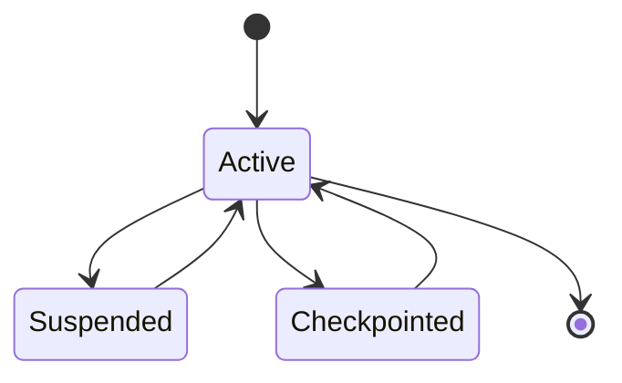
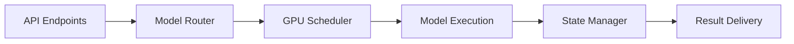
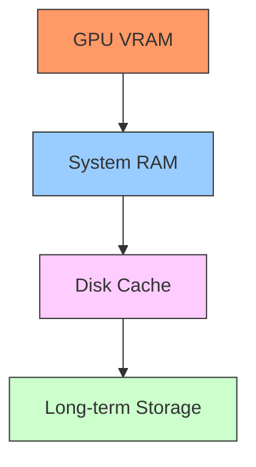
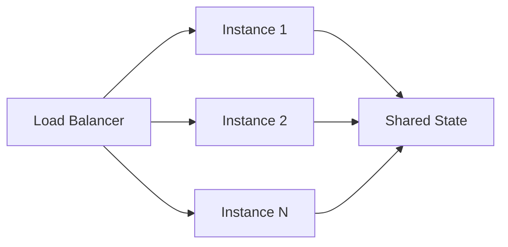

# Bolt.new Glossary

## Core Concepts

### Resource Management
- **GPU Optimization**: Technique of dedicating full GPU resources to a single model execution for maximum quality output. In our system, this specifically refers to optimizing for the NVIDIA 4060 GPU.
- **Resource Allocation**: The process of assigning computational resources (GPU, memory, CPU) to specific tasks based on priority and requirements.
- **Task Chunking**: Breaking down large tasks into manageable pieces while maintaining context and quality.

### Model Management
- **Model Orchestration**: The system responsible for coordinating multiple AI models, managing their execution, and routing tasks appropriately.
- **Quality-First Approach**: Design philosophy prioritizing output quality over processing speed, achieved through dedicated resource allocation.
- **Model Queue**: Organized system for managing multiple model requests while ensuring optimal resource utilization.

### State Management
- **State Preservation**: Complex system for maintaining context, decisions, and progress across multiple sessions and interactions.
- **Context Management**: Handling and preserving the contextual information necessary for consistent model operation.
- **Memory System**: Infrastructure for managing both short-term (active session) and long-term (project history) information.

### Performance Terms
- **Latency**: Time between request submission and response delivery.
- **Throughput**: Amount of tasks processed in a given time period.
- **Quality Metrics**: Measurements used to assess the quality of model outputs and system performance.

### Development Concepts
- **Hot Reload**: Development feature allowing code changes to take effect without full system restart.
- **Preview System**: Real-time visualization of code changes and model outputs.
- **Development Environment**: Configured system for local development and testing.

## Advanced AI Concepts

### Model Optimization
- **Quantization**: Process of reducing model precision (8-bit, 4-bit) to improve performance while maintaining quality.
  ```mermaid
  graph LR
      A[32-bit Model] --> B[Quantization]
      B --> C[8-bit Model]
      B --> D[4-bit Model]
      C --> E[Faster Inference]
      D --> F[Reduced Memory]
  ```

- **RLHF** (Reinforcement Learning with Human Feedback): System for model improvement through user feedback.
  ```mermaid
  graph TD
      A[User Input] --> B[Model Response]
      B --> C[User Feedback]
      C --> D[Feedback Collection]
      D --> E[Model Adjustment]
      E --> F[Improved Model]
      F --> B
  ```

- **MoE** (Mixture of Experts): Task routing system using specialized models.
  ```mermaid
  graph TD
      A[Task] --> B[Router]
      B --> C[Expert 1: Code]
      B --> D[Expert 2: Debug]
      B --> E[Expert 3: Refactor]
      C --> F[Result]
      D --> F
      E --> F
  ```

### Resource Management

#### GPU Optimization
- **Batch Processing**: Grouping similar tasks for efficient processing
- **Gradient Clipping**: Preventing training instability
- **Memory Management**: VRAM allocation and deallocation strategies

#### State Management


## Technical Terms

### Hardware-Specific
- **CUDA Cores**: Processing units in NVIDIA GPUs used for parallel computation.
- **VRAM**: Video RAM, dedicated GPU memory used for model operations.
- **Memory Bandwidth**: Rate at which memory can be accessed by the GPU.

### Software Components
- **Model Router**: Component responsible for directing tasks to appropriate models.
- **Resource Monitor**: System for tracking and optimizing resource usage.
- **State Manager**: Component handling state preservation and context management.

### Integration Points
- **API Endpoints**: Interface points for external communication with the system.
- **WebSocket Connections**: Real-time communication channels for streaming data.
- **Event Handlers**: Components managing system events and responses.

## Security Framework

### Access Control
- **RBAC** (Role-Based Access Control)
  ```mermaid
  graph TD
      A[User] --> B[Role Assignment]
      B --> C[Admin]
      B --> D[Developer]
      B --> E[Viewer]
      C --> F[Full Access]
      D --> G[Limited Access]
      E --> H[Read Access]
  ```

### Data Protection
- **SSL/TLS**: Secure communication protocols
- **API Security**: Key management and access control
- **State Encryption**: Secure storage of project state

## System Components

### User Interface
- **Command Palette**: Quick access to commands and features
- **Chat Interface**: AI interaction window
- **Preview System**: Real-time code visualization

### Integration Points


## Real-World Scenarios

### Task Chunking Example
```typescript
// Large task breakdown
interface TaskChunk {
    id: string;
    content: string;
    dependencies: string[];
    priority: number;
}

// Processing workflow
const processTask = async (task: Task) => {
    const chunks = chunkTask(task);
    const results = await processChunks(chunks);
    return mergeResults(results);
};
```

### State Management Example
```typescript
interface ProjectState {
    context: {
        models: Model[];
        resources: Resources;
        preferences: UserPreferences;
    };
    history: {
        decisions: Decision[];
        feedback: Feedback[];
    };
}
```

## Performance Optimization

### Memory Hierarchy


### Resource Allocation
| Resource Type | Priority | Usage |
|--------------|----------|--------|
| GPU VRAM | Highest | Model Execution |
| System RAM | High | Context Storage |
| Disk Cache | Medium | State Preservation |
| Storage | Low | History & Logs |

## Deployment Concepts

### Containerization
- **Docker**: Application encapsulation
- **Dependencies**: Runtime requirements
- **Environment**: Configuration management

### Scaling


## Best Practices

### Resource Usage
- **Optimal Load**: Recommended resource utilization levels for best performance.
- **Quality Thresholds**: Minimum acceptable quality levels for various operations.
- **Resource Scheduling**: Best practices for managing resource allocation.

### Development
- **Code Standards**: Established coding practices and guidelines.
- **Testing Protocols**: Recommended approaches for system testing.
- **Documentation Requirements**: Standards for maintaining system documentation.

### Development Workflow
1. Code Generation
2. Quality Check
3. Resource Optimization
4. State Preservation
5. Performance Monitoring

### Quality Assurance
- **Automated Testing**: Unit and integration tests
- **Performance Metrics**: Resource usage and latency
- **User Feedback**: Continuous improvement cycle

## Common Abbreviations
- **GPU**: Graphics Processing Unit
- **VRAM**: Video Random Access Memory
- **API**: Application Programming Interface
- **UI/UX**: User Interface/User Experience
- **PR**: Pull Request
- **CI/CD**: Continuous Integration/Continuous Deployment
- **RLHF**: Reinforcement Learning with Human Feedback
- **MoE**: Mixture of Experts
- **RBAC**: Role-Based Access Control
- **SSL**: Secure Sockets Layer
- **TLS**: Transport Layer Security
